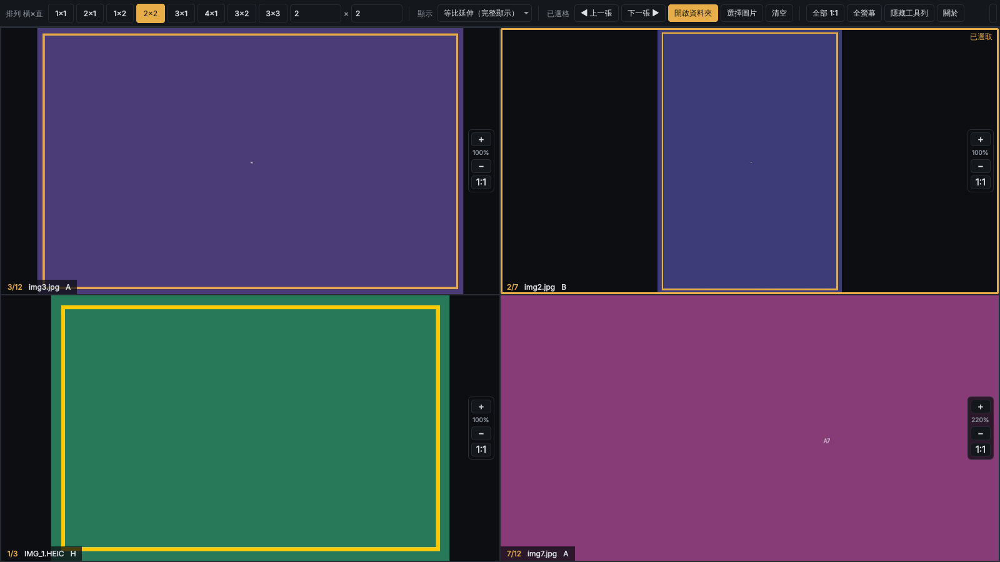

# 多格看圖器 MultiGrid Viewer



多格排列的離線看圖程式。自訂 橫×直 版面，每一格各自瀏覽一個資料夾、各自縮放平移，適合並排比對多張圖片。

A grid-based offline image viewer for side-by-side comparison. Each panel browses its own folder and keeps its own zoom.

**版本** 1.0 · 2026/10/8 · **製作人** Skypray Huang · **授權** MIT

## 功能

- 版面：1×1、2×1、2×2、4×1、3×3… 或自訂 橫×直（最多 8×8）
- 拖「單張圖片」到某一格，自動載入同資料夾全部圖片並停在該張；拖「資料夾」則含子資料夾一起載入
- 每格獨立切換：點選一格後，滾輪 / 方向鍵只換這一格
- 每格獨立縮放與平移，切換上下張時保留倍率與位置
- 預設等比延伸（不變形）；可改等比填滿或原始大小
- 支援 JPG、PNG、GIF、BMP、WebP、TIFF、HEIC / HEIF（iPhone 照片），依 EXIF 自動轉正
- 工具列可一鍵隱藏，支援全螢幕

## 安裝與執行

需要 Python 3.10 以上（建議 3.13，已測試）。

```bash
pip install -r requirements.txt
python multigrid_viewer.py [圖片或資料夾 ...]
```

Windows 可直接雙擊 `run_viewer.bat`（第一次會自動安裝套件）。

### 打包成 exe（Windows）

雙擊 `build_exe.bat`，完成後執行檔位於 `dist\MultiGridViewer.exe`，可複製到沒有 Python 的電腦使用。
對圖片按右鍵 →「開啟檔案」→ 選此 exe，即可設為預設看圖程式。

## 操作

| 動作 | 方式 |
|---|---|
| 選格 | 點一下某一格（金色框 = 已選取） |
| 上一張 / 下一張 | 滾輪、← → ↑ ↓、PageUp / PageDown、空白鍵、工具列按鈕（只換已選格） |
| 第一張 / 最後一張 | Home / End |
| 放大 / 縮小 | 每格右側 ＋ / −、Ctrl+滾輪（以游標為中心）、鍵盤 + / - |
| 恢復原始填滿 | `/` 或 `0`（已選格）；`*`（全部格子）；或每格右側 1:1 |
| 平移 | 按住左鍵拖曳；雙擊 = 放大 2 倍 / 還原 |
| 開啟 | 拖曳到格子、空白格雙擊、工具列「開啟資料夾」「選擇圖片」 |
| 隱藏工具列 | `H`；隱藏後按左上角 ☰ 叫回 |
| 全螢幕 | `F` 或 `F11`，`Esc` 離開 |
| 關於 | `F1` |

## Code signing policy

Free code signing provided by [SignPath.io](https://about.signpath.io/), certificate by [SignPath Foundation](https://signpath.org/).

- Committers and reviewers: [Skypray Huang](https://github.com/)
- Approvers: [Skypray Huang](https://github.com/)

Privacy policy: This program will not transfer any information to other networked systems. It only reads the image files and folders that the user opens.

## 授權

本程式以 [MIT License](LICENSE) 釋出，Copyright © 2026 Skypray Huang。

使用之第三方元件：
[Qt for Python / PySide6](https://doc.qt.io/qtforpython/)（LGPL-3.0）、
[Pillow](https://python-pillow.org/)（MIT-CMU）、
[pillow-heif](https://github.com/bigcat88/pillow_heif)（BSD-3-Clause，內含 libheif 等函式庫，各自有其授權）。
